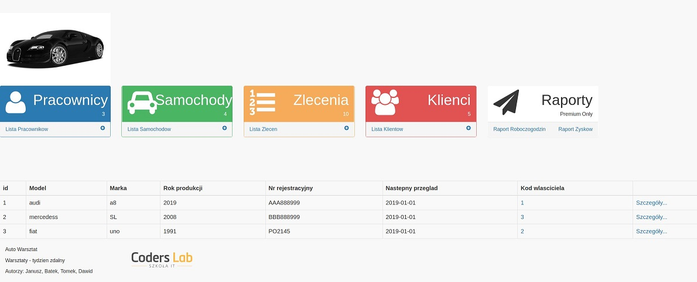

# AutoWarsztat
Polish below / polski poniżej
________________________
CRM system for managing car workshop. Basic CRUD functions from servlets.
Doing this project our team was using Scrum rules and principals.

Technologies used: Java, Bootstrap, Java Servlets, mySQL, jsp
_________________________
Warsztat samochodowy - tydzień pracy zdalnej
CRM do zarządzania warsztawtem samochodowym. podstawowe funkcje zapisu / odczytu / edycji do bazy danych z poziomu serwletów.
Projekt realizowany w grupie przy wykorzystaniu SCRUM.

Użyte technologie: Java, Java Servlety, jsp, bootstrap

